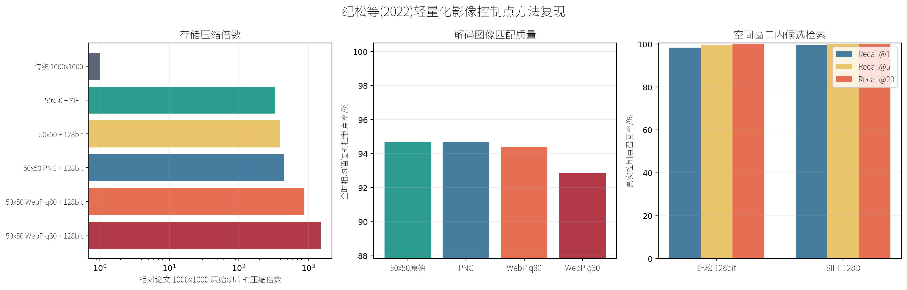
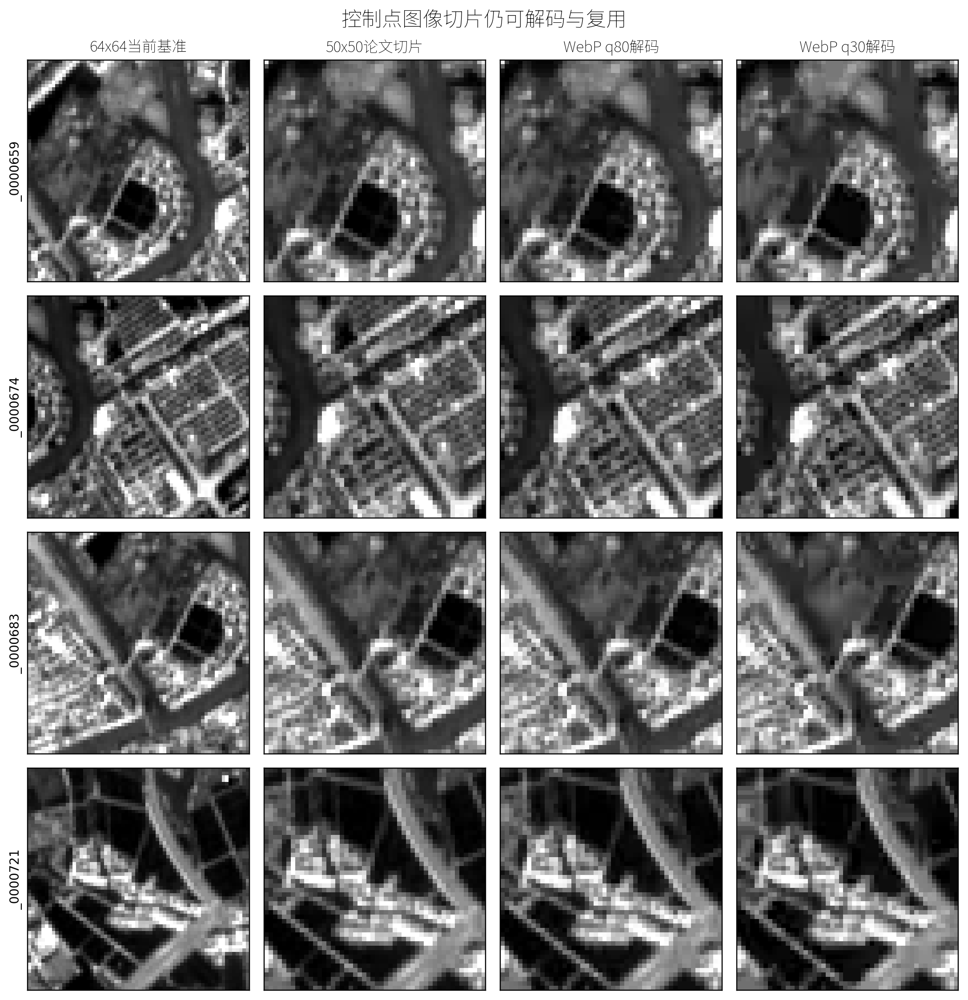

# GCP 公开成果图

这个仓库只保存可公开查看的实验图片和简要结果，不包含原始遥感数据、模型或内部代码。

## 纪松等（2022）轻量化影像控制点方法复现

上海全量实验使用 12,804 个候选点，其中 12,227 个点形成 31,827 条有效多时相测量。

### 压缩与匹配质量

[点击查看原始分辨率图片](ji-song-2022/compression_and_quality_cn.png)

### 可解码切片对比

[点击查看原始分辨率图片](ji-song-2022/chip_examples_cn.png)

### 主要结果

| 方法 | 全量估算 | 模型摊销后压缩倍数 | 全时相保留率 | 中位位置变化 |
|---|---:|---:|---:|---:|
| RAW50 + 128 bit | 29.63 MiB | 393.53x | 94.70% | 0 m |
| PNG50 + 128 bit | 26.45 MiB | 440.85x | 94.70% | 0 m |
| WebP q80 + 128 bit | 13.40 MiB | 869.91x | 94.41% | 0.034 m |
| WebP q30 + 128 bit | 7.73 MiB | 1509.01x | 92.84% | 0.100 m |

质量优先推荐 WebP q80。128 bit 哈希只作为候选检索索引，最终精匹配仍使用可解码图像切片。
