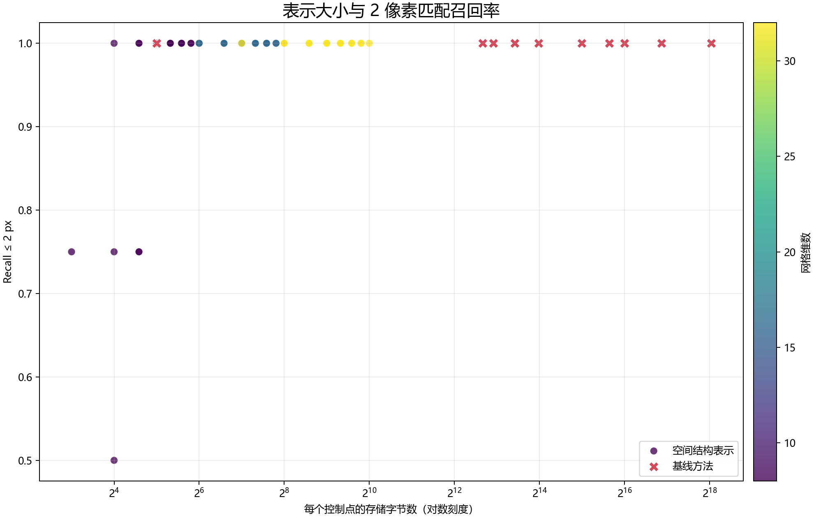
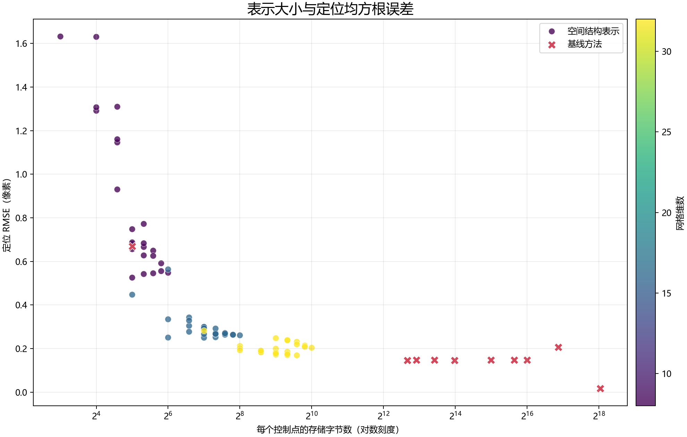
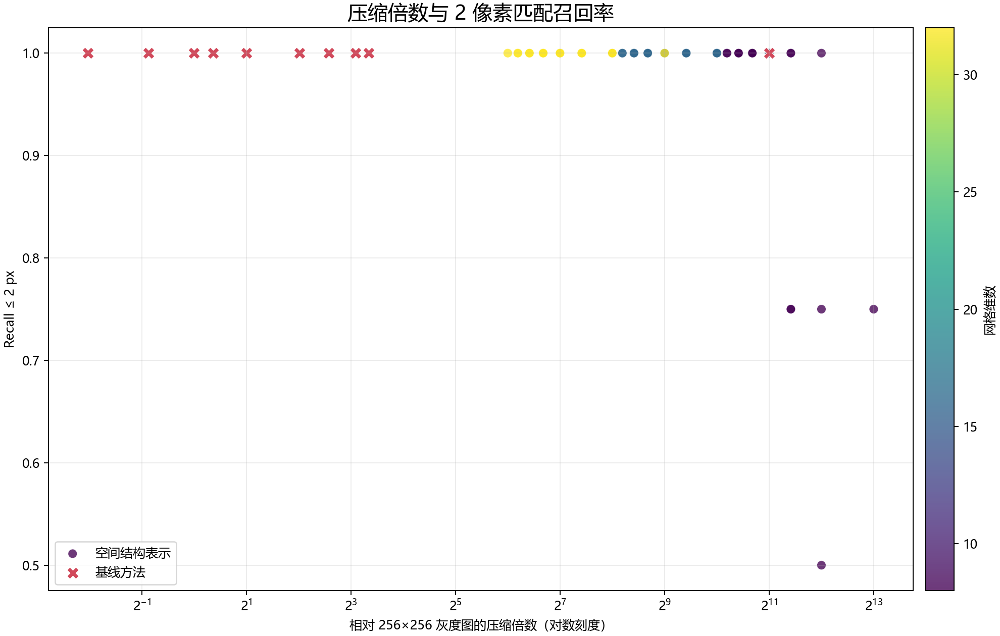
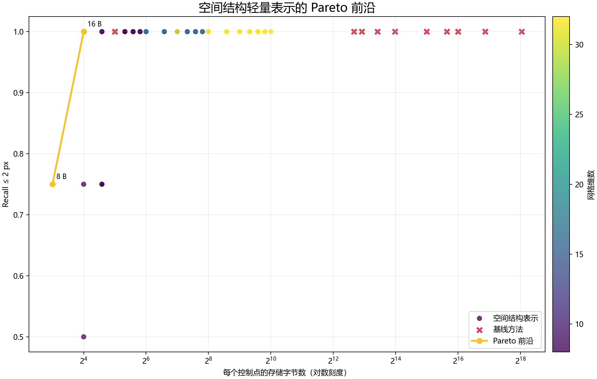

# GCP 空间结构轻量表示：第一阶段实验

本页发布非学习版“空间结构保持型轻量表示”的可复现实验结果。主方法不重建原始 patch，也不依赖 SIFT/ORB 单一描述子；候选窗口和参考控制点都编码为低比特二维网格后直接匹配。

## 本次烟雾实验

- 输入：`256×256 uint8` 灰度 patch，原始大小 65,536 B；
- 数据：4 组固定随机种子的城市场景合成局部搜索窗口；
- 位移：包含整数与亚像素平移，并加入亮度、对比度和噪声变化；
- 消融：3 个网格 × 3 个幅值位宽 × 4 个方向位宽 × 2 个边缘开关，共 72 组；
- 基线：raw NCC、ORB、SIFT、median binary、WebP Q30/Q50、JPEG2000 四档；
- 状态：82 行汇总结果全部成功，无失败影像对。

这组结果用于确认工程链路和指标计算正确，不能代替真实多时相遥感影像上的最终结论。

## 目标存储档位

以下是在本次合成实验中，同一字节档位按 `Recall≤2px` 优先、RMSE 次优选出的配置：

| 大小 | 网格 | 幅值 bit | 方向 bit | 边缘 bit | 压缩倍数 | Recall≤2px | RMSE |
| ---: | ---: | ---: | ---: | ---: | ---: | ---: | ---: |
| 64 B | 16 | 2 | 0 | 0 | 1024× | 1.00 | 0.251 px |
| 128 B | 16 | 1 | 3 | 0 | 512× | 1.00 | 0.250 px |
| 256 B | 32 | 2 | 0 | 0 | 256× | 1.00 | 0.193 px |
| 512 B | 32 | 1 | 2 | 1 | 128× | 1.00 | 0.172 px |

其中 `64 B` 的另一组全字段配置 `grid=8, mag=4, orientation=3, edge=1` 同样达到 `Recall≤2px=1.00`，RMSE 为 `0.548 px`。真实遥感数据应重新选择 Pareto 点，不能直接照搬合成数据中的最优位宽。

## 图表

[](bytes_per_patch_vs_recall_2px.png)

[](bytes_per_patch_vs_rmse.png)

[](compression_ratio_vs_recall.png)

[](pareto_frontier.png)

## 可下载结果

- [72 组消融与基线汇总](ablation_summary.csv)
- [逐影像对匹配结果](pair_results.csv)
- [128 B 原始 bitstream 示例](sample_128B.bin)
- [128 B bitstream 配置与字段布局](sample_128B.bin.json)
- [独立命令行匹配结果](sample_match.json)

完整实现位于私有项目仓库的 `gcp_compact/` 目录。实验命令：

```powershell
conda activate lyc
python -m gcp_compact.experiments `
  --synthetic-demo `
  --output N:\OUTPUT\gcp_compact_spatial_representation_OUTPUT\synthetic_smoke
```

下一轮应把真实 GCP patch、对应的新时相局部搜索窗口和真值中心写入 `pairs.csv`，保持同一套 72 组配置和评价脚本不变，才能回答“64–512 B 表示在真实多时相遥感匹配中能保留多少质量”。
