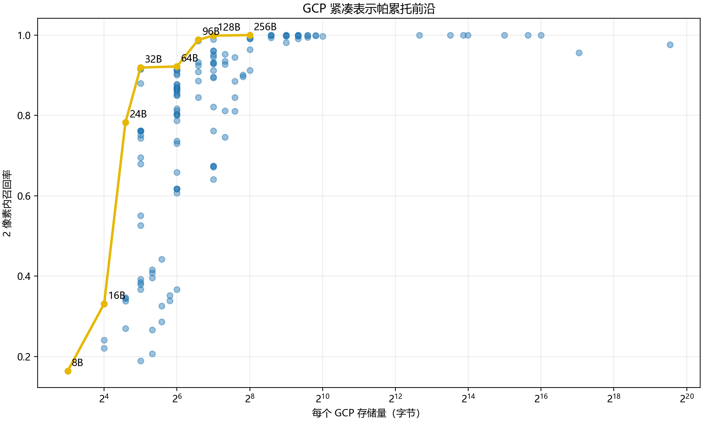
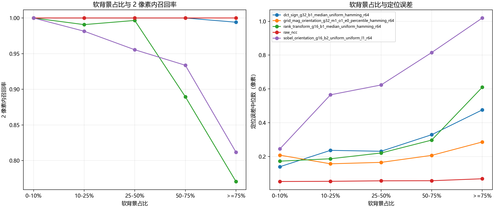
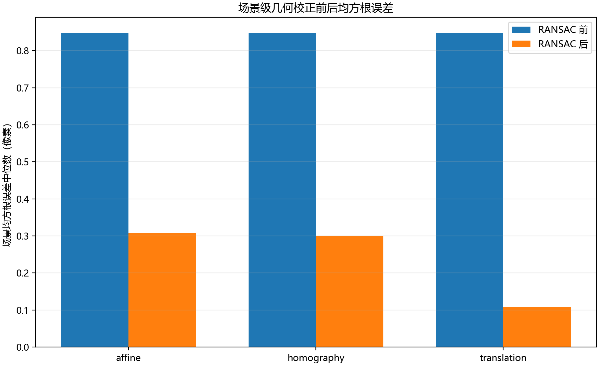
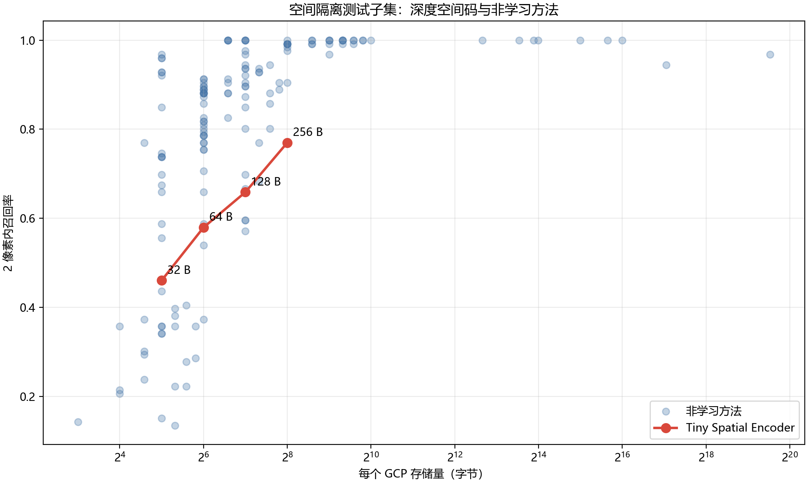
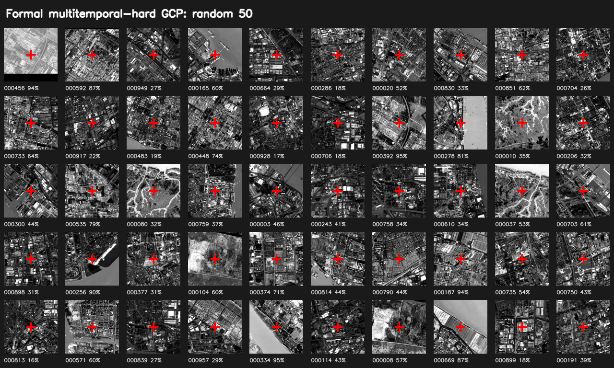
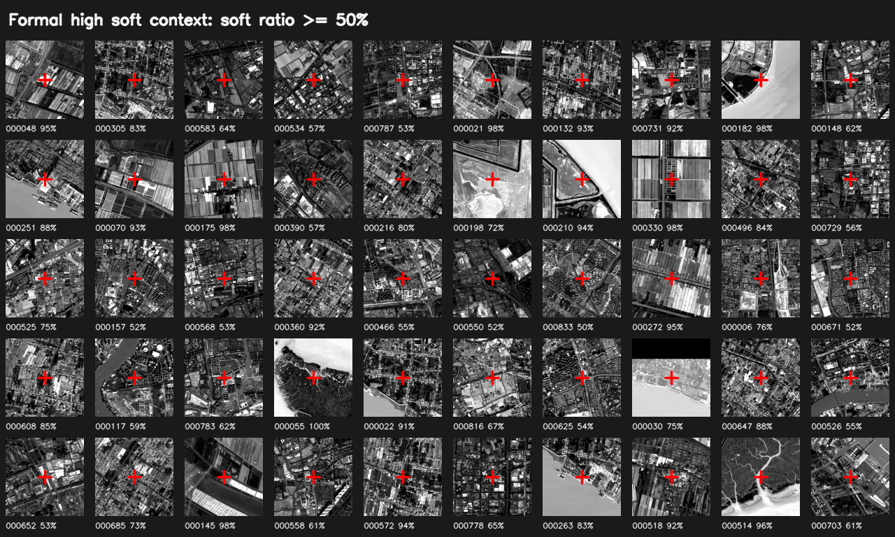
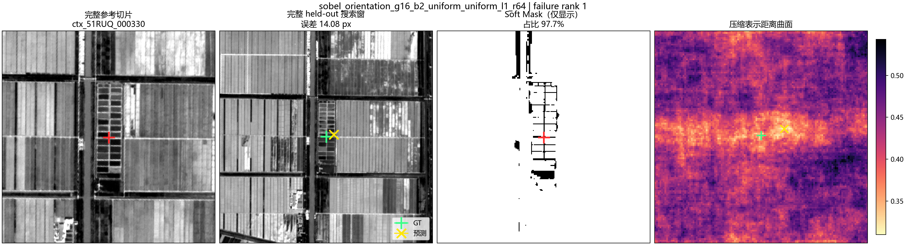

# GCP Compact Representation：真实完整上下文实验

本页发布 2026-08-24 上海 Sentinel-2 context-preserved GCP 实验的轻量结果。正式数据重新生成 **849 个完整 256x256 GCP Patch**，其中 **755 对**进入高置信 held-out 多时相测试。

> 关键规则：Soft Mask 只判断候选中心能不能选，绝不修改最终 Patch。河流、植被、农田、阴影、建筑和道路等周围上下文均完整保留。

## 主要结论

| 表示 | Bytes/GCP | 相对 8-bit 灰度压缩倍数 | Recall <=2 px | RMSE (px) | P95 (px) |
|---|---:|---:|---:|---:|---:|
| Rank transform | 32 B | 2048x | 91.92% | 11.327 | 12.214 |
| Sobel orientation + L1 | 64 B | 1024x | 92.19% | 1.295 | 2.251 |
| DCT sign + Hamming | 128 B | 512x | 99.87% | 0.471 | 0.883 |
| Magnitude + orientation + Hamming | 256 B | 256x | 100.00% | 0.336 | 0.651 |
| Raw NCC | 65,536 B | 1x | 100.00% | 0.079 | 0.109 |

- 64 B 的 translation-RANSAC 在 2 px 阈值下得到 92.7% 内点率，校正后重投影 RMSE 为 0.102 px。
- 128 B DCT-sign 是本轮最强轻量折中点。
- 32 B 虽然中位误差很小，但在重复纹理和高 soft-context 中存在灾难性失败，RMSE 因长尾升高。
- 6 轮 Tiny Spatial Encoder 未超过非学习方法；同一空间隔离测试子集上，256 B 深度码 Recall <=2 px 为 76.98%，同预算非学习方法为 100%。

## 核心图

## 数据构造抽查

红十字表示候选中心。图中每张 Patch 都保留完整影像上下文，百分数为 soft-context ratio。

## 失败案例

失败图依次给出完整 reference Patch、完整 held-out 搜索窗、仅用于显示的 Soft Mask，以及压缩表示距离面。绿色十字为 GT，黄色叉号为预测位置。

## 方法概览

- 数据：Sentinel-2 L2A B04 10 m 正射影像与 SCL，Overture 上海水体、land cover、land use 仅作中心语义约束。
- 候选中心：SIFT、ORB、AKAZE、BRISK、KAZE、FAST、AGAST、Shi-Tomasi、Harris、MSER、Blob、Laplacian、Hough intersection，共 13 类检测器，经 20 px NMS 和跨方法融合。
- 时间隔离：2021-2023 用于候选稳定性，2024 为 reference，2025/2026 为未参与选点和调参的 held-out target。
- 匹配：target 搜索窗中按 1 px 步长生成同构紧凑表示，直接比较 Hamming、L1、L2 或 cosine，不恢复原图。
- 亚像素：整数最优点附近 3x3 距离面抛物线插值。
- 几何：按场景比较 translation、affine、homography RANSAC。
- 真低比特：1/2/3/4 bit 量化值实际打包为 bytes；3,396 个导出 bitstream 均通过长度和 SHA-256 校验。

## 文件入口

- [完整中文总结](SUMMARY_CN.md)
- [Pareto 表](tables/pareto.csv)
- [推荐编码与精确预算](tables/recommended_representation_methods.csv)
- [真实 bitstream 导出统计](tables/representation_export_summary.csv)
- [72 组完整网格消融](tables/grid_ablation_results.csv)
- [压缩距离函数对照](tables/distance_results.csv)
- [复杂背景分组](tables/soft_context_matching_results.csv)
- [RANSAC 场景汇总](tables/ransac_scene_summary.csv)
- [深度实验](tables/deep_results.csv)
- [20 个失败案例索引](failure_cases/index.csv)
- [公开结果完整性审计](PUBLIC_INTEGRITY.json)

## 精度口径

GT 由 held-out target 上的灰度、Scharr 和 edge 相关面共识及亚像素精化得到，是实验像素域标注，不是外业测量真值。文中的 px 是 Sentinel-2 10 m 原始像素，不能据此直接声称绝对亚米地理精度。旧 Dataset A 存在多时相强筛选泄漏，仅作为历史 easy 对照。

