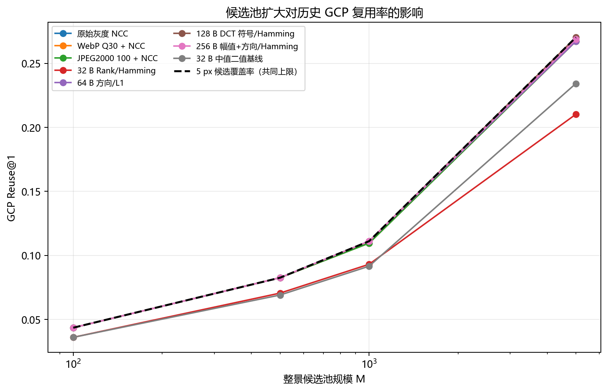
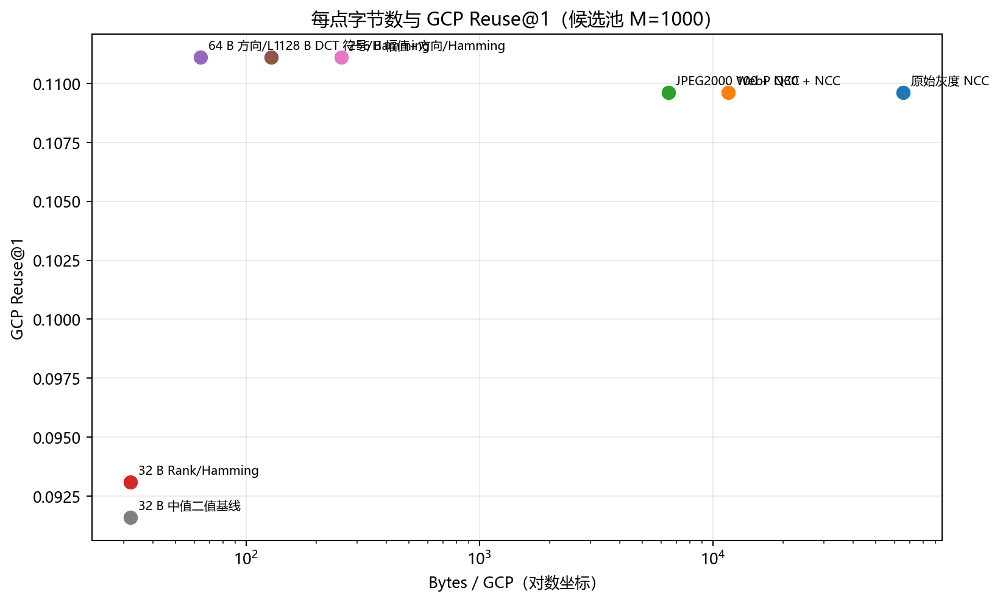
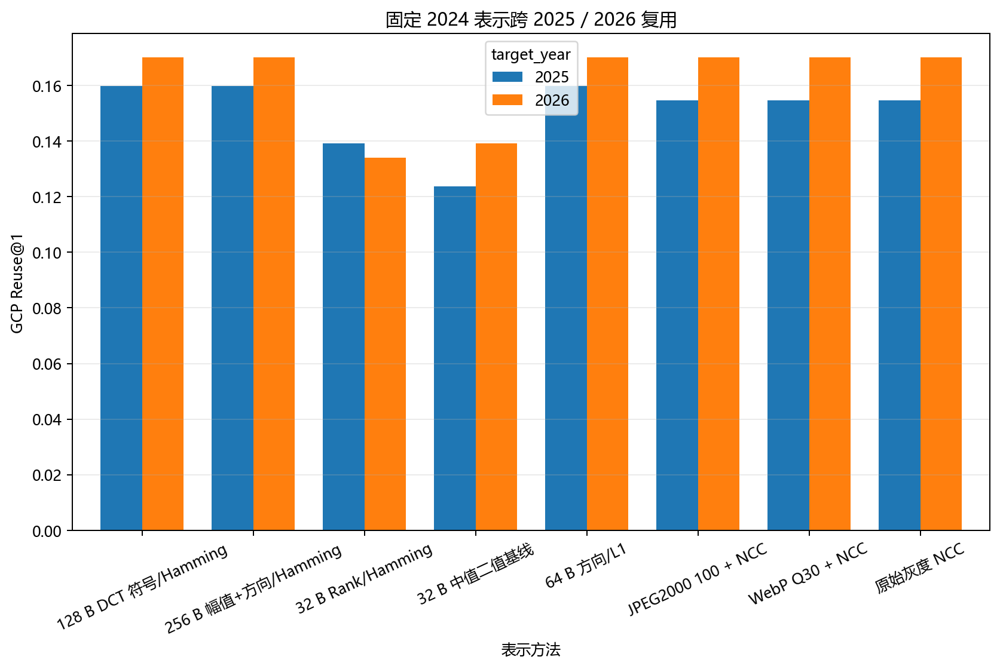
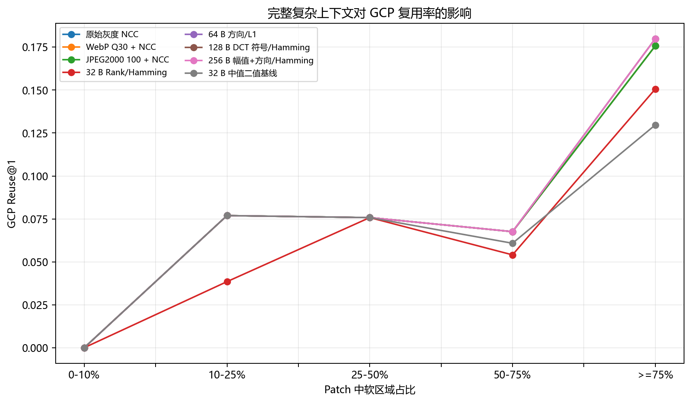
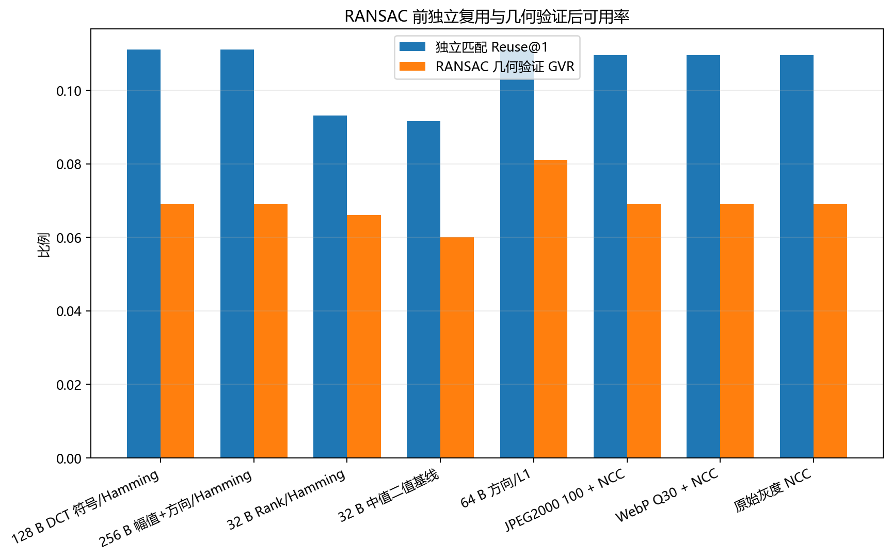

# GCP Compact Representation：可复用性评估首轮实验

本页发布整景候选重识别实验的轻量结果。历史 2024 GCP 表示只编码一次；目标候选池在读取 GT 前冻结；GT 只用于评价真实候选 rank。

## 首轮结论

- 固定历史 GCP：500 个；高质量跨时相查询：666 条。
- M=1000：候选覆盖率 11.1%；64 B 与 128 B 端到端 Reuse@1 均为 11.1%。
- 候选存在时：64 B 与 128 B 的条件 Reuse@1 均为 100%。
- M=5000：候选覆盖率 27.0%；128 B 端到端 Reuse@1 为 27.0%。
- 128 B 成功复用后，±32 px 条件定位 RMSE 约 0.50 px，median 约 0.34 px。
- 以全部 666 次尝试为分母，最佳全局 GVR 为 8.1%（64 B 方向/L1 + affine RANSAC）。
- 当前瓶颈首先是无 GT 注入的全景候选覆盖率，而不是 64/128 B 表示对已覆盖候选的辨识能力。

## 完整报告

- [中文结果与 12 个必答问题](REUSABILITY_SUMMARY_CN.md)
- [7 类、共 140 张成功/失败案例](FAILURE_GALLERY.md)
- [公开结果完整性审计](PUBLIC_INTEGRITY.json)

## 核心图

## 可下载表格

- [reuse_summary.csv](tables/reuse_summary.csv)
- [paired_temporal_reuse_summary.csv](tables/paired_temporal_reuse_summary.csv)
- [conditional_localization_summary.csv](tables/conditional_localization_summary.csv)
- [outcome_abcd_summary.csv](tables/outcome_abcd_summary.csv)
- [ransac_global_summary.csv](tables/ransac_global_summary.csv)
- [soft_context_reuse_summary.csv](tables/soft_context_reuse_summary.csv)
- [storage_projection.csv](tables/storage_projection.csv)
- [candidate_pool_coverage.csv](tables/candidate_pool_coverage.csv)

## 公开边界

本目录不含原始遥感数据、完整候选 patch、绝对本地路径、目标候选缓存或逐 GCP bitstream。图中的 building/road failure 标签是自动启发式上下文标签。
